- # 1. Collbirative work with some of my coleges 

### here is the link for his beutifull thougths about the project  

 [post is  here ](https://www.linkedin.com/posts/aminabuzahra_students-gift-activity-7285093388515774464-8y2-?utm_source=share&tm_medium=member_desktop)

### Important Note
 to maximize my The core principle of this project is to avoid using any external assets. All models were built using Unity's native shapes, and both the controllers and coding were developed entirely in-house, without relying on any external tools.
and also to use basic transformation rotation to animate everything, without any physics

## Main Role 
### C# developer , Game Designer , Artist 
### Short Gameplay vedio

[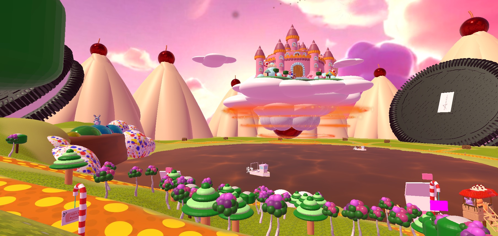](https://youtu.be/OoRil-WJMUE)

## What did i do

### Modling 

- Main Castle 
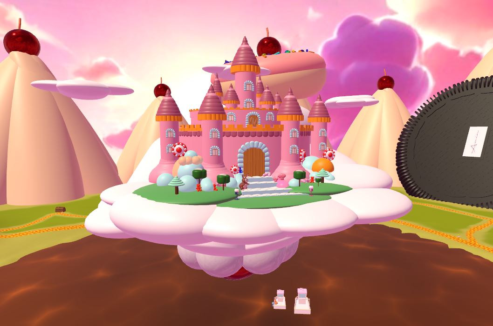

- Biscuit Watchtower

- Train station
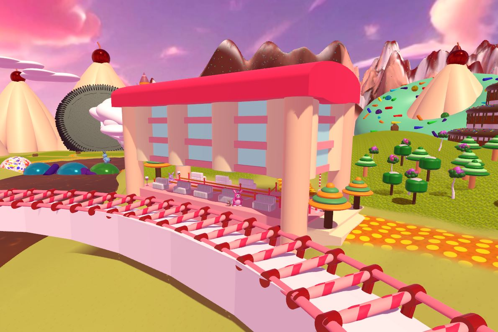

- Bunny
Edit Unity Inspector by Code
and control the Movement of the bunny
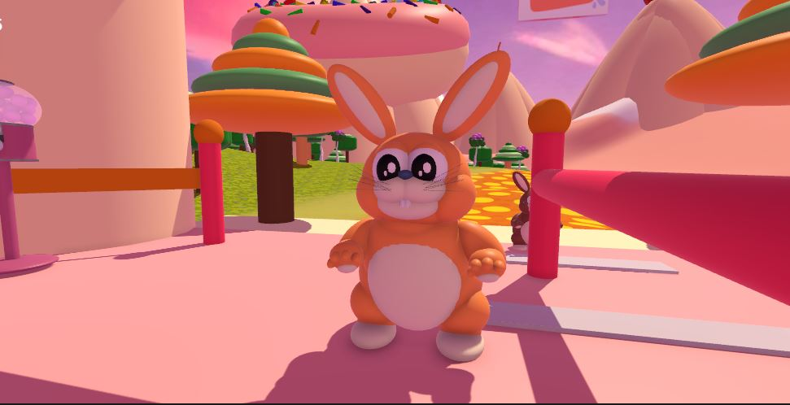

### Shaders
- Chocolate Shader For Rivers and Cake ChocolateFall
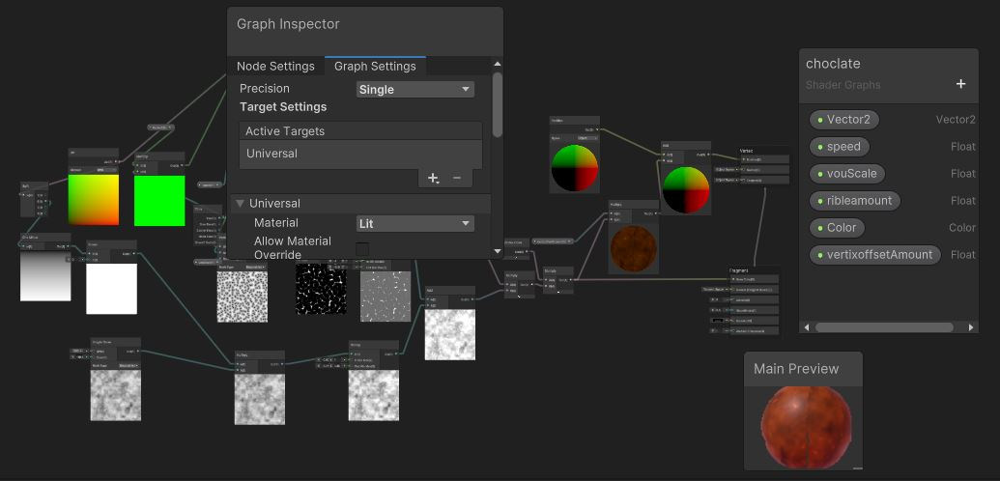

### Coding
- Bunny Movment Controller
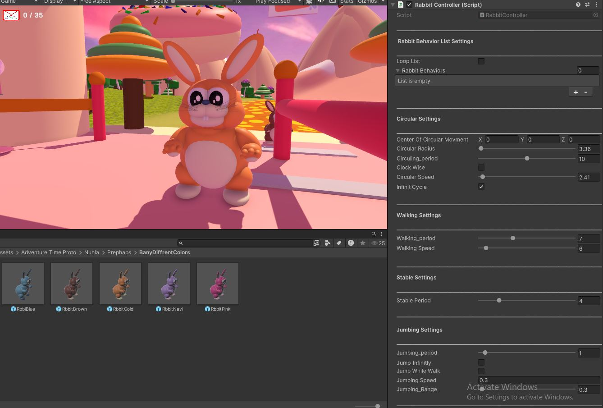

- TV Controller (Switch on and off Video - increase /decrease Sound)
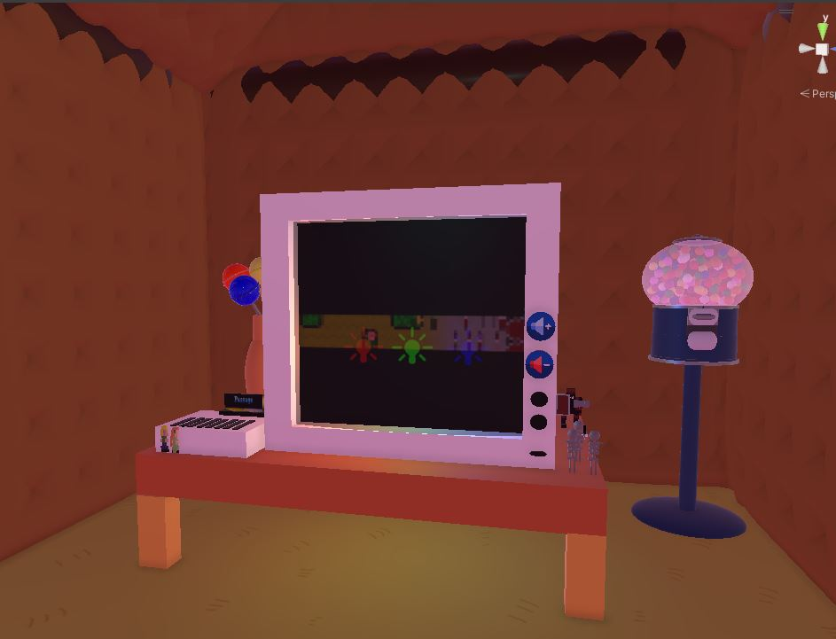

- Ship Modling & Movment Controller 
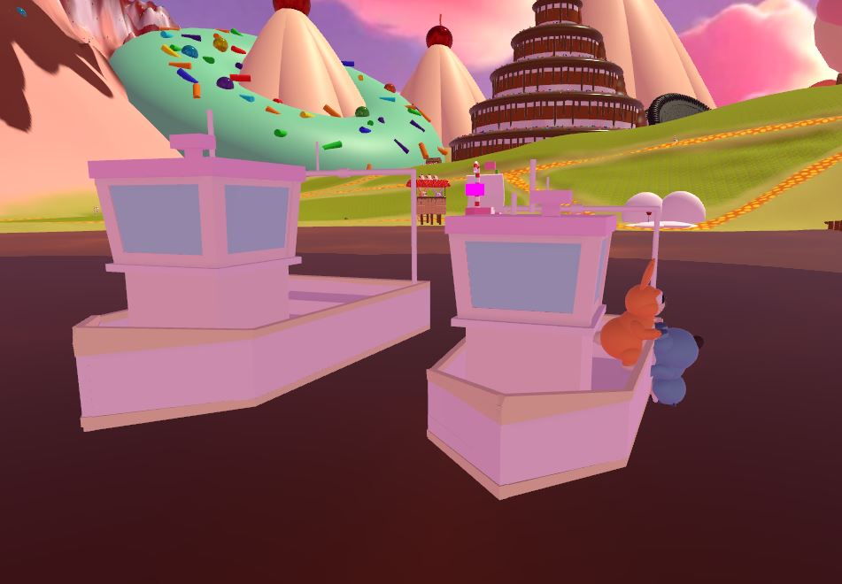

- # AR
### 2.  Some of my Participation in the ARFoundation Experience in creating Navigation Content (Indoor & outdoor navigation ), we used many Techs besides Augmented Reality  Offered by Unity ARFoundation SDK including :
1. google Geospatial anchors.
2. Mapbox Routing and Navigation.
3. Image Detecting 
4. AI

[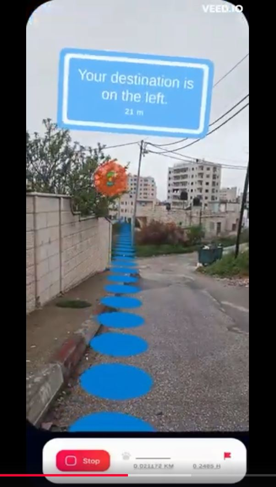](https://youtube.com/shorts/WmIDuExrIZI?feature=share)

- # VR - (Sabastya Prototype)

 ### PROTOTYPE PROJECT  
 Multiple videos are Available

[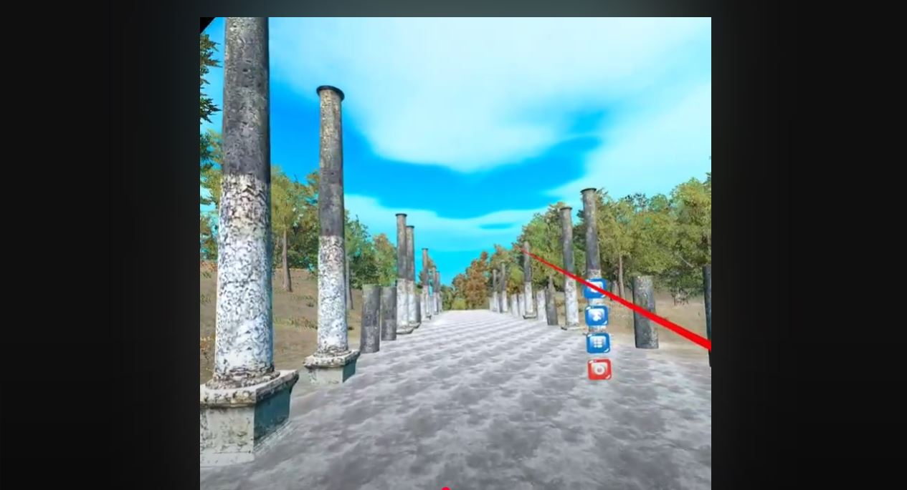](https://youtu.be/Fc2u36ow8xo)
[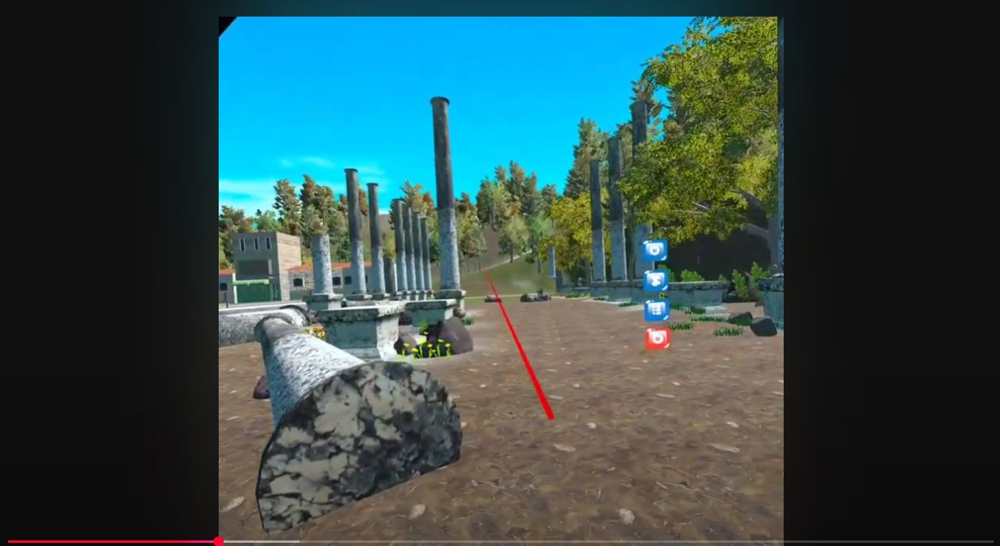](https://youtu.be/L_DYARxAlKI)

 ### My Main Role 
 c# developer 3D Modling

 - # 2D Game 

 [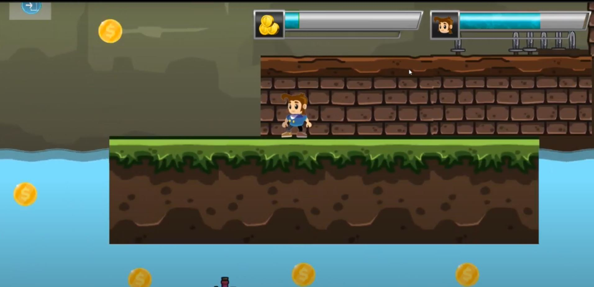](https://youtu.be/8BLL8cNaNyc)

 ### link to Game https://nuhla.itch.io/monycollecter

 ### Main Role Solo Project - Full Unity Development 

 - ## Some Unity Artwork

    -   #### Car Toy 

        [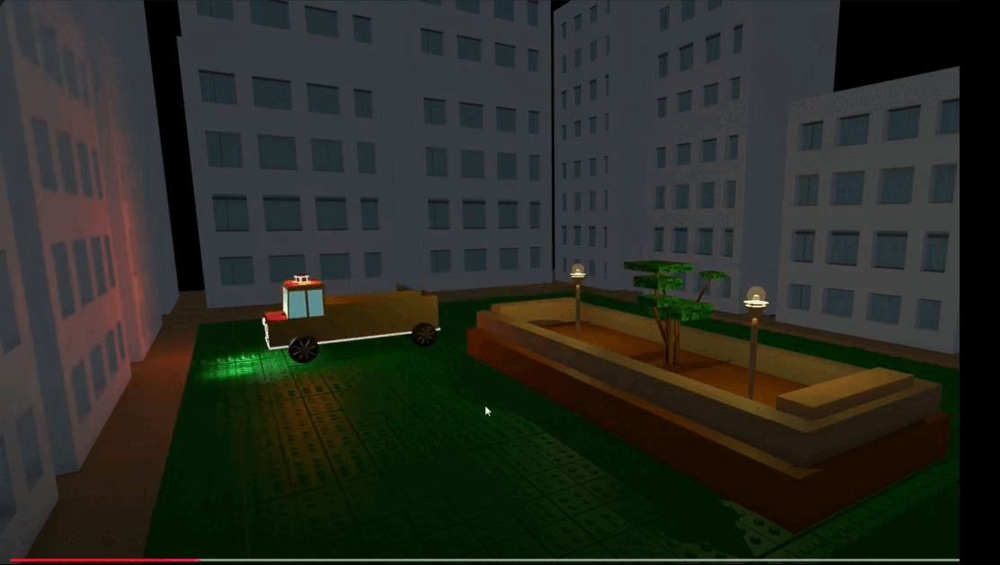](https://youtu.be/JMWvb9eYjOw)

    
    -  ### Interactive Pop-Up Box with Interactive Diorama

        [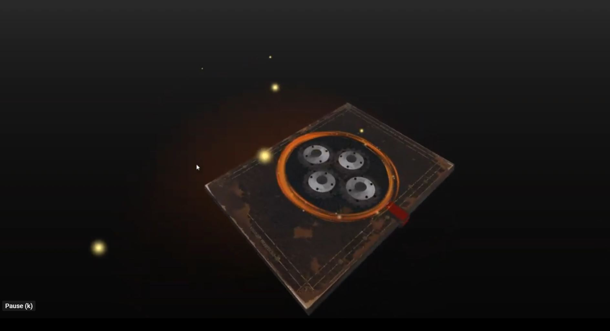](https://youtu.be/mwO3kxo0QFw)

    -  ### Kinetic Sculpture

        [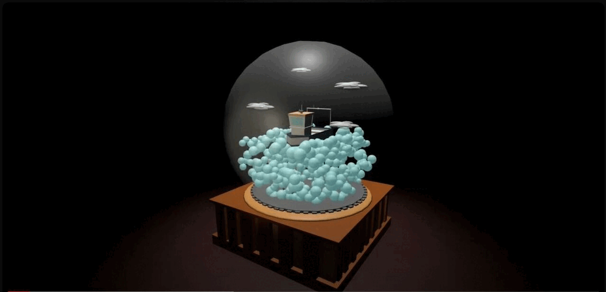](https://youtu.be/Fo8O1e7wBrI)

    - ### Shadows 
         [(IMGS/KinaticSculture.JPG)]